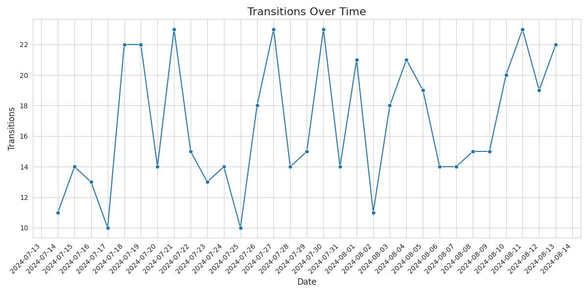

# The Technicalities of Reproducibility - Git Exercise

This is a Git exercise, part of the "The technicalities of reproducibility" learning unit, of the learning path ["Technical skills are the bridge to reproducible research. An introduction for data librarians."](https://github.com/Task-4-2/Technical-Skills-as-bridge-to-reproducible-research). The materials have been developed within work package 4.2 of the [Skills4EOSC project](https://www.skills4eosc.eu/). More detailed information about the learning path is available in the [corresponding Git book](https://task-4-2.github.io/Technical-Skills-as-bridge-to-reproducible-research/latest/).

## Exercise Description

Your task is to analyze the history of the following files:

- `01_raw_data/20240813_1_state_transition_projection_algo1.csv`
- `02_scripts/02_visualize.py`

### Question 1

Has there been manual data manipulation in `20240813_1_state_transition_projection_algo1.csv`? 

- If yes, who performed it and when?
- If yes, what was the original value, before the change?
- Tip: Analyse the history of line 32 in the CSV file

### Question 2

Analyze the file `02_scripts/02_visualize.py`. The following expression controls the rotation of the text on the x-axis of the generated visualizations. An example is available in the `03_graphics` folder and also shown below.



```python
plt.xticks(rotation=90, ha='right')
```

- Analyze the file's history and determine the GitHub username of the user that altered the visualization generation code.
- What was the previous rotation value?
